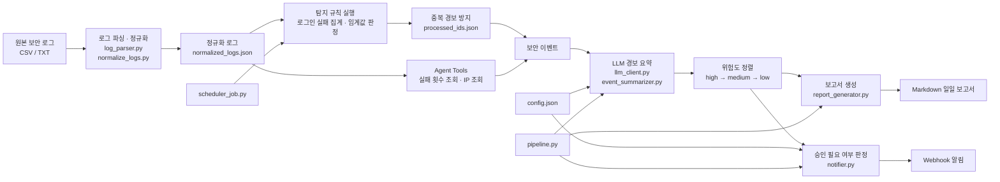

# agent_core

보안 로그를 입력받아 **정규화 → 탐지 → 경보 처리 → LLM 요약 → 보고서 생성 → 알림**까지 연결한 보안 에이전트 실습 코드입니다.

## 처리 흐름



## 구현 내용

1. **로그 처리**
   - CSV/텍스트 로그 읽기
   - 예외가 있는 로그를 건너뛰고 `logging`으로 기록
   - 정규표현식으로 비정형 로그에서 시간, 레벨, 사용자, IP 추출
   - 정규화 결과와 매칭 실패 로그 분리 저장

2. **탐지 규칙**
   - 로그인 실패 횟수 집계
   - 일정 횟수 이상 실패한 계정 탐지
   - 위험도와 임계값을 기준으로 사람 확인이 필요한 경보 판정
   - `processed_ids.json`으로 이미 처리한 경보의 중복 전송 방지

3. **CLI · Webhook**
   - `argparse`로 포트, 룰, 실행 주기 입력 처리
   - Flask Webhook 서버에서 JSON 경보 수신
   - 수신 경보를 JSON 파일로 저장
   - shell/curl 기반 Webhook 호출 테스트

4. **스케줄링**
   - `schedule`을 이용해 로그 점검 작업 반복 실행
   - 새로 탐지된 경보만 처리하도록 상태 저장

5. **LLM 연동**
   - `.env`에서 Gemini API Key 로드
   - 보안 경보를 여러 건씩 묶어 LLM에 전달
   - 응답을 JSON으로 파싱
   - 경보별 `high / medium / low` 위험도와 한국어 요약 생성
   - 위험도 순으로 정렬

6. **Agent Tool 구성**
   - 특정 계정의 로그인 실패 횟수 조회
   - IP의 국가/ISP 조회
   - Tool Registry에 함수를 등록하고 이름에 따라 실행하는 Tool Router 구현

7. **보고서 생성**
   - 전체 경보 수와 high 경보 수 계산
   - LLM으로 전체 경보 총평 생성
   - 위험도순 건별 요약과 통계를 Markdown 보고서로 생성
   - 날짜별 `daily_report_YYYYMMDD.md` 저장

8. **설정 기반 통합 파이프라인**
   - `config.json`에서 모델, 승인 기준 위험도, 보고서 경로, Webhook URL 관리
   - 필수 설정값 검증
   - `pipeline.py`에서 다음 흐름을 한 번에 실행

```text
보안 이벤트
  → LLM 요약
  → 위험도 정렬
  → 총평 생성
  → Markdown 보고서 저장
  → 사람 확인 필요 건수 계산
  → Webhook 알림
```

9. **검토 · 디버깅**
   - 단위 테스트 실습
   - 오류가 있는 코드 실행 후 원인 확인 및 수정
   - 전체 파이프라인 점검과 회고

## 핵심 파일

| 파일 | 역할 |
|---|---|
| `log_parser.py` | CSV 로그 파싱, 예외 처리, 로그인 실패 집계 |
| `normalize_logs.py` | 정규표현식 기반 로그 정규화 |
| `webhook_server.py` | Webhook 경보 수신 및 저장 |
| `scheduler_job.py` | 주기적 로그 점검 및 중복 경보 방지 |
| `llm_client.py` | Gemini API 호출 및 JSON 응답 파싱 |
| `event_summarizer.py` | 경보 배치 요약 및 위험도 정렬 |
| `tool_router.py` | Agent Tool 등록 및 실행 라우팅 |
| `report_generator.py` | 보안 경보 Markdown 보고서 생성 |
| `notifier.py` | 설정 검증, 승인 기준 판정, Webhook 알림 |
| `pipeline.py` | 전체 처리 과정 통합 실행 |
| `config.json` | 모델·승인 기준·보고서·Webhook 설정 |

## 실습 진행 순서

| 날짜 | 내용 |
|---|---|
| 09/23 | 조건문·반복문·집계, 함수·파일·CSV |
| 09/28 | 예외 처리·Logging, 중첩 JSON |
| 09/29 | 정규표현식 로그 탐지, 룰/API |
| 10/02 | Webhook·CLI, Trigger·Scheduler |
| 10/06 | LLM Prompt, Agent Tools |
| 10/07 | 경보 요약, 보고서 생성 |
| 10/08 | 설정 기반 통합 Pipeline, 코드 리뷰·테스트·디버깅 |
